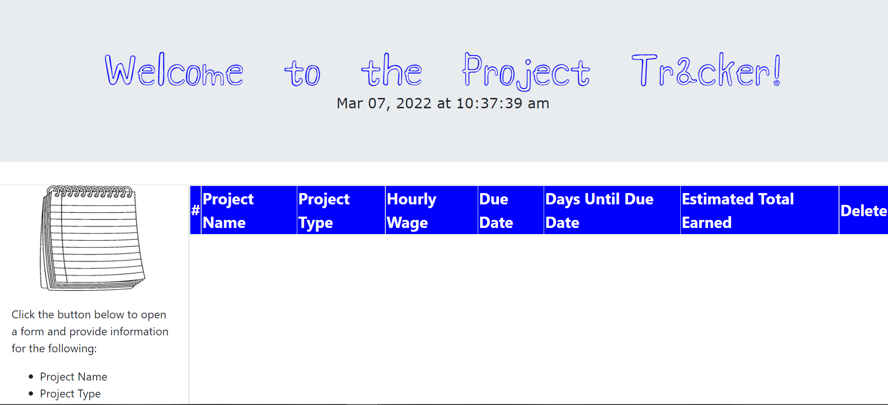
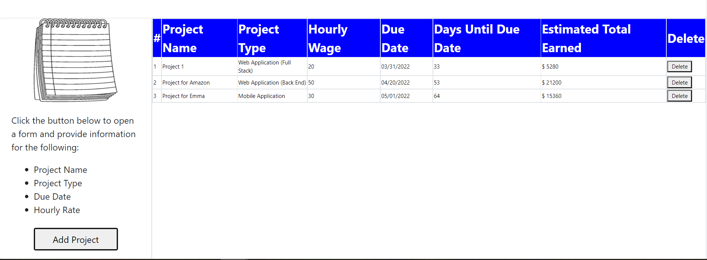

# Project-Tracker

## Description:
This application allows software developers to manage projects they are currently working on. Users can input the name of the project, type of project, project due date and their hourly rate for the project. Once they have submitted this information, the application calculates how many days the user has to complete the project and the amount of $ they will make in those days. Users can also delete projects. 

## Built With:
* Javascript
* [jQuery](https://jquery.com/)
* [Moment.js](https://momentjs.com/)
* HTML
* CSS

## Deployed Links:
* [Link to Deployed Site](https://egraham96.github.io/Project-Tracker/)
* [Link to GitHub Repo](https://github.com/egraham96/Project-Tracker)

## Preview of Working Site:

## How to Contribute:
If you'd like to contribute to this project please send an email to eeg4@uw.edu or message me on github: egraham96.
 
## License:
